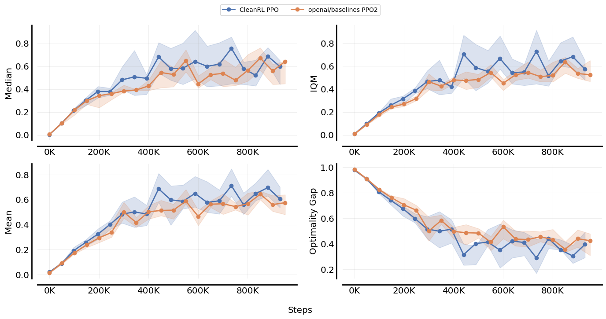

I am a PhD Student in the [PCOG](https://pcog.uni.lu/) group at the University of Luxembourg. My current research interests are Multi-Objective Optimization, Reinforcement Learning, and Swarm Applications. I am currently working on Automating the Design of Autonomous Robot Swarms ([ADARS](https://adars.uni.lu/)) project, under the supervision of [Grégoire Danoy](https://danoy.gforge.uni.lu/). Because I believe in open source AI, I'm also contributing to the [Farama Foundation](https://farama.org/), a non-profit organization aiming at facilitating the development of open-source tools for Reinforcement Learning.

I am convinced that specifying AI problems as single-objective is often not enough since we often make compromises in real-life situations. To me, the fact that most our current flagship applications in such an advanced field as AI are single-objective is appalling.

<em>The consequences of learning multiple behaviours, based on different trade-offs in the objectives. Here, the agent learns to run differently based on the trade-off between energy consumption and velocity.</em>

Before my PhD, I specialized into combinatorial optimization techniques such as Constraint Programming, Local Search, Meta-heuristics Algorithms. I worked a few years in the industry on supply chain optimization, planning problems, and have been exposed to various software engineering challenges. 

Aside from the cool things mentionned above, I am into cinema, cycling, and beers (yes, I am Belgian).

  

<em>Left: the Epuck robots, some of our toys in ADARS. Right: the Crazyflie robots in action.</em>

<h1> Open source </h1>

<h2> A suite for reproducible research in MORL </h2>
We wrote a few repositories aiming at helping researchers in reproducing results of existing MORL algorithms as well as facilitating the whole research process by providing clean implementations and examples. By making this public, our hope is to attract even more people to the MORL field and remove boilerplate from the research process. 

<h3> MO-Gymnasium </h3>

<a href="https://github.com/Farama-Foundation/MO-Gymnasium">MO-Gymnasium</a> is a library containing multiple multi-objective RL environments. These environments are all under a standardized API, allowing to test your algorithms on multiple benchmarks without the need to change your code. Since 2023, MO-Gymnasium has been integrated in the <a href="https://farama.org">Farama foundation</a> suite, aside to other RL projects such as <a href="https://github.com/Farama-Foundation/Gymnasium">Gymnasium</a> and <a href= "https://github.com/Farama-Foundation/PettingZoo">PettingZoo</a>.

<h3> MORL-baselines </h3>

<a href="https://github.com/LucasAlegre/morl-baselines">morl-baselines</a> is a repository containing multiple MORL algorithms using MO-Gymnasium. We aim to provide clean, reliable and validated implementations as well as tools to help in the development of such algorithms. Features include automated experiments tracking for reproducibility, hyper-parameter optimization, multi-objective metrics, and more.

<h3> Open RL Benchmark </h3>

<a href="https://github.com/openrlbenchmark/openrlbenchmark">openrlbenchmark</a> is a comprehensive collection of tracked experiments for RL. It aims to make it easier for RL practitioners to pull and compare all kinds of metrics from reputable RL libraries like Stable-baselines3, Tianshou, CleanRL, and others.

<h2> CrazyRL </h2>

<a href="https://github.com/ffelten/CrazyRL">CrazyRL</a> is a MOMARL library under a multi-objective extension of the  <a href= "https://github.com/Farama-Foundation/PettingZoo">PettingZoo</a> API. It allows to learn swarm behaviours in a variety of environments, such as the one shown on the left. It is still under development, but we hope to release it soon.

