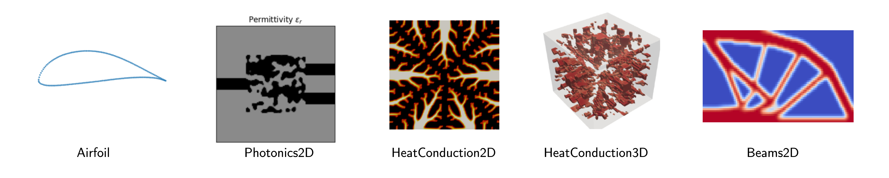

> I'm currently taking a few months to explore entrepreneurship. Maybe I'll come up with something useful; I'll certainly learn along the way. I'll try to document what I learn each month during this journey.

Before that, I was a PostDoc at ETH Zürich, working on automated design with [Mark Fuge](https://ideal.umd.edu/team/mark-fuge). My research areas: Multi-Objective Optimization, Reinforcement Learning, and Benchmarking. 

... Before that, I was a PhD Student in the [PCOG](https://pcog.uni.lu/) group at the University of Luxembourg, under the supervision of [Grégoire Danoy](https://danoy.gforge.uni.lu/), where I did a [thesis on Multi-Objective RL](https://ffelten.github.io/files/Thesis_website.pdf). And won several awards from [FNR](https://www.fnr.lu/fnr-awards-2025-discover-the-winners/), and from the [University of Luxembourg](https://www.uni.lu/research-en/news/excellent-doctoral-thesis-awards-2024-in-science/).

... and even before that I was a tech lead at [N-SIDE](https://www.n-side.com/), a company specialized in optimization software.

<iframe width="560" height="315" src="https://www.youtube.com/embed/VEXRuhJDkoA" title="YouTube video player" frameborder="0" allow="accelerometer; autoplay; clipboard-write; encrypted-media; gyroscope; picture-in-picture" allowfullscreen></iframe>

<em>This is my PhD thesis in a nutshell.</em>

Aside from the cool things mentionned above, I am into cinema, cycling, and beers (yes, I am Belgian).

<h1> Most significant publications </h1>
* EngiBench: A Framework for Data-Driven Engineering Design Research: [NeurIPS (2025)](https://openreview.net/forum?id=YowD33Q89V).
* Multi-Objective Reinforcement Learning Based on Decomposition: A Taxonomy and Framework: [JAIR (2024)](https://www.jair.org/index.php/jair/article/view/15702).
* Toolkit for MORL: [NeurIPS (2023)](https://openreview.net/forum?id=jfwRLudQyj).

<h1> Open source </h1>
I have been quite involved in open source stuffs over the past few years. And I'm quite proud to say the amazing tools we've built have been downloaded several hundreds of thousands of times. I'm a member of the [Farama Foundation](https://farama.org/), a non-profit organization aiming at facilitating the development of open-source tools for Reinforcement Learning.

<h2> EngiBench </h2>

 
<a href="https://engibench.ethz.ch/">EngiBench</a> offers a collection of engineering design problems, datasets, and benchmarks to facilitate the development and evaluation of optimization and ML algorithms for engineering design. Our goal is to provide a standard API to enable researchers to easily compare and evaluate their algorithms on a wide range of engineering design problems--think wings of aircrafts, beams, heat conduction components. We also give generative algorithms compatible with the API in <a href="https://github.com/IDEALLab/EngiOpt">EngiOpt</a>.

 

<h2> A toolkit for reliable research in MORL </h2>
We wrote a few repositories aiming at helping researchers in reproducing results of existing MORL algorithms as well as facilitating the whole research process by providing clean implementations and examples. By making this public, our hope is to attract even more people to the MORL field and remove boilerplate from the research process.  A paper describing the whole toolkit has been published at <a href="https://openreview.net/forum?id=jfwRLudQyj">NeurIPS23</a>.

<h3> MO-Gymnasium </h3>

<a href="https://github.com/Farama-Foundation/MO-Gymnasium">MO-Gymnasium</a> is a library containing multiple multi-objective RL environments. These environments are all under a standardized API, allowing to test your algorithms on multiple benchmarks without the need to change your code. Since 2023, MO-Gymnasium has been integrated in the <a href="https://farama.org">Farama foundation</a> suite, aside to other RL projects such as <a href="https://github.com/Farama-Foundation/Gymnasium">Gymnasium</a> and <a href= "https://github.com/Farama-Foundation/PettingZoo">PettingZoo</a>.

<h3> MORL-baselines </h3>

<a href="https://github.com/LucasAlegre/morl-baselines">MORL-Baselines</a> is a repository containing multiple MORL algorithms using MO-Gymnasium. We aim to provide clean, reliable and validated implementations as well as tools to help in the development of such algorithms. Features include automated experiments tracking for reproducibility, hyper-parameter optimization, multi-objective metrics, and more.

<h3> Open RL Benchmark </h3>

<a href="https://github.com/openrlbenchmark/openrlbenchmark">OpenRLBenchmark</a> is a comprehensive collection of tracked experiments for RL. It aims to make it easier for RL practitioners to pull and compare all kinds of metrics from reputable RL libraries like Stable-baselines3, Tianshou, CleanRL, and MORL-Baselines of course 😎.

 

<h2> MOMAland </h2>

<a href="https://github.com/Farama-Foundation/momaland">MOMAland</a> is a standard MOMARL API and suite of environments. Basically a multi-agent version of MO-Gymnasium, or a multi-objective version of PettingZoo 🙂. Also integrated into the Farama toolkit. 
  
   
Paper: <a href="https://arxiv.org/abs/2507.10000">MOMAland: A Set of Benchmarks for Multi-Objective Multi-Agent Reinforcement Learning</a>

 

<h2> CrazyRL </h2>

<a href="https://github.com/ffelten/CrazyRL">CrazyRL</a> is a MOMARL library under a multi-objective extension of the  <a href= "https://github.com/Farama-Foundation/PettingZoo">PettingZoo</a> API. It allows to learn swarm behaviours in a variety of environments, such as the one shown on the left. We also implemented the full MOMARL loop on GPU using Jax, allowing to train agents 2000x faster than when the environment runs on the CPU. Check the video on 
<a href="https://www.youtube.com/watch?v=4FeTjZnpgJI&ab_channel=FlorianFelten">YouTube</a>.

