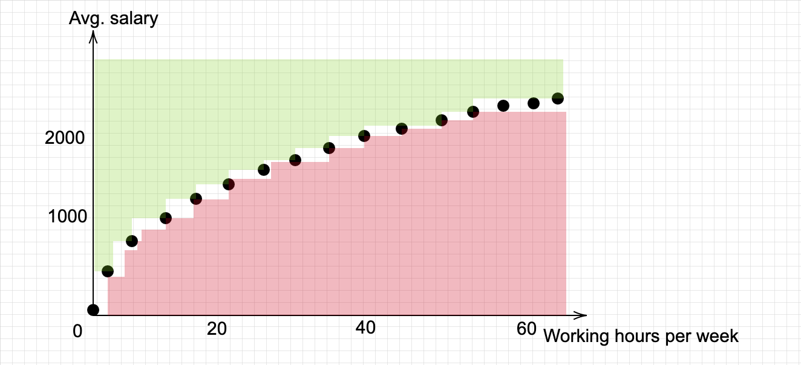

> Life is made up of compromises.
>
> -- <cite> Edith Warton </cite>

Now that I look cultivated with my citation, I might have one or two things to develop on the matter. As an optimization fan, I am constantly identifying situations where we could be more efficient in our lives, this post is about the efficiency of decisions. 

Decisions in life are very often subject to compromises. For example, in our society, one has to trade its time for money - we usually refer to that as "working". 

To optimize such choices, what we usually do is observe multiple life scenarios and their outcomes. Here, I will use data generated by my imagination for the sake of the example, but be assured that it is close to what we do in AI or optimization. So, my data are average salaries per month, based on the working hours per week of a person. Here is what it would look like in a table:

| Hours of work | Avg. Salary | 
| --- | --- |
| 0 | 0 |
| 2 | 200 |
| ... | ... |
| 35 | 1800 |
| 40 | 2000 |
| ... | ... |
| 60 | 3000 |
| 80 | 4000 | 

In a graph, the data would look like this:

Naturally, you can see in the graph that the more time you spend working, the more money you can expect. So far, the data seem logical and everything makes sense. Notice that I have drawn two zones also in the graph. The red one is the inefficient zone; it means that if you are in that zone, well friend you work too much for your salary. The green zone is the unusually good zone, it means that you are doing better than the average for the hours you do. You can think of a billionaire for the latter.

In the middle, we can observe a curve. That curve is the efficiency zone: whenever you are on a point on that zone, it is in general impossible to increase one criteria, without sacrifying in the other. For example, you cannot earn more without working more, and you cannot work less without losing salary. This concept is called [Pareto efficiency](https://en.wikipedia.org/wiki/Pareto_efficiency) by the economists and guys like me.

Well now the news is that as long as you stay on that curve, no point is objectively better than the other. That means a person working 20 hours a week for 1000€ is not "better" or "worse" than a person working 40 for 2000€. This precise thing illustrates one of the many compromises we have to make in life.

*Take-home* - Finally, here is what science says: the point which is optimal depends on the **person's preferences**. So, yes, earning less money than your neighbour can be optimal for you, if you prefer more free time. And no, working full-time just "because everyone does" is not necessarily the best strategy for you (and that's OK!). 
